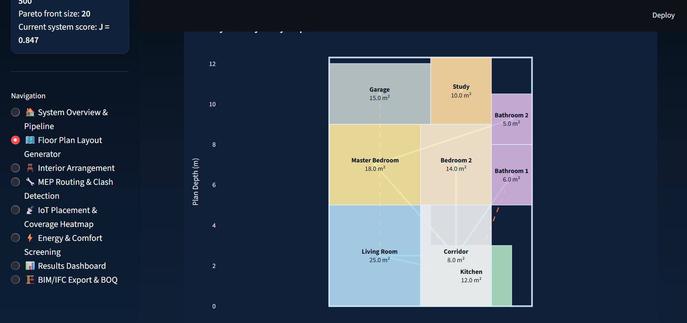
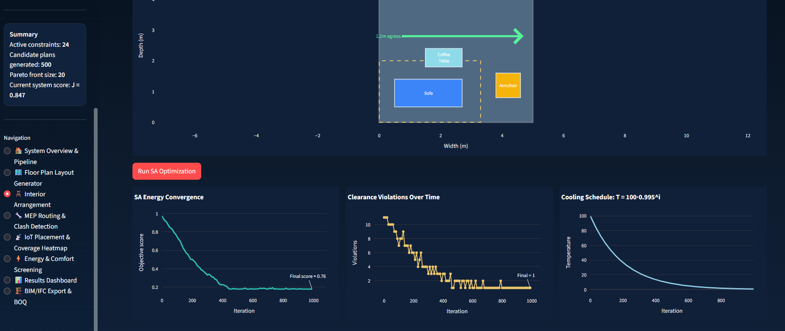
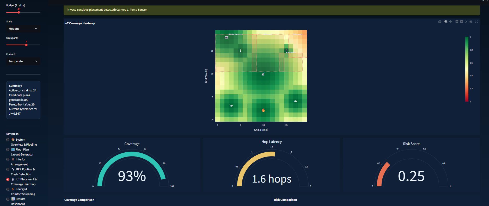
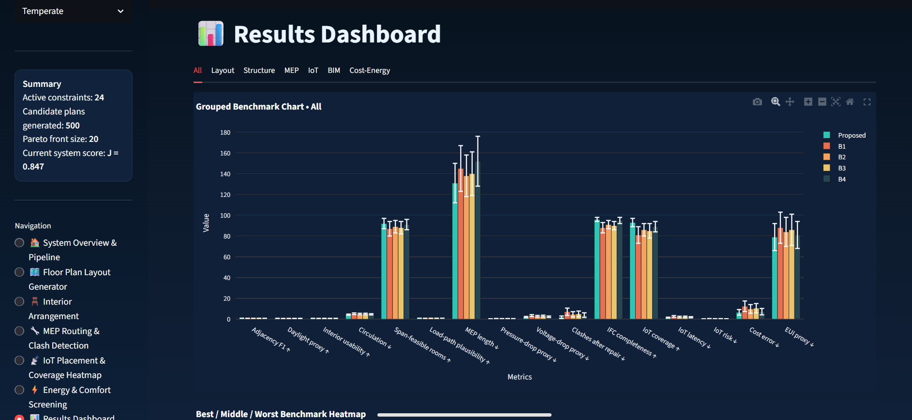
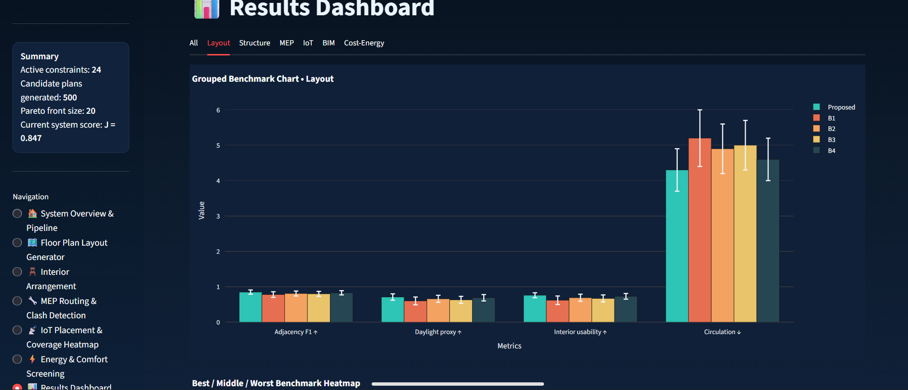
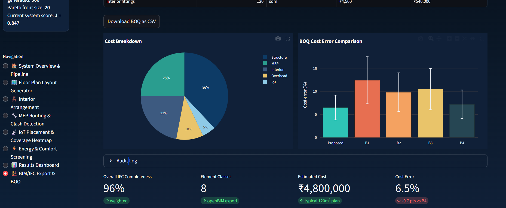
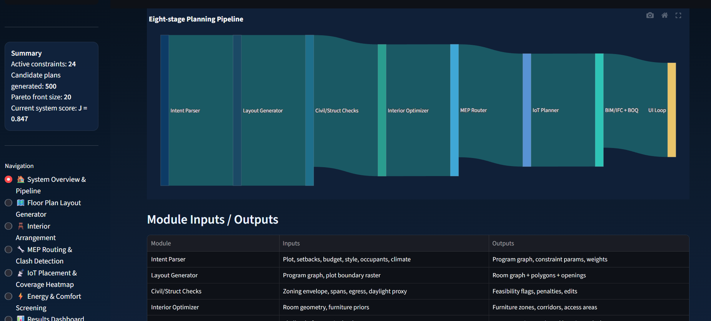
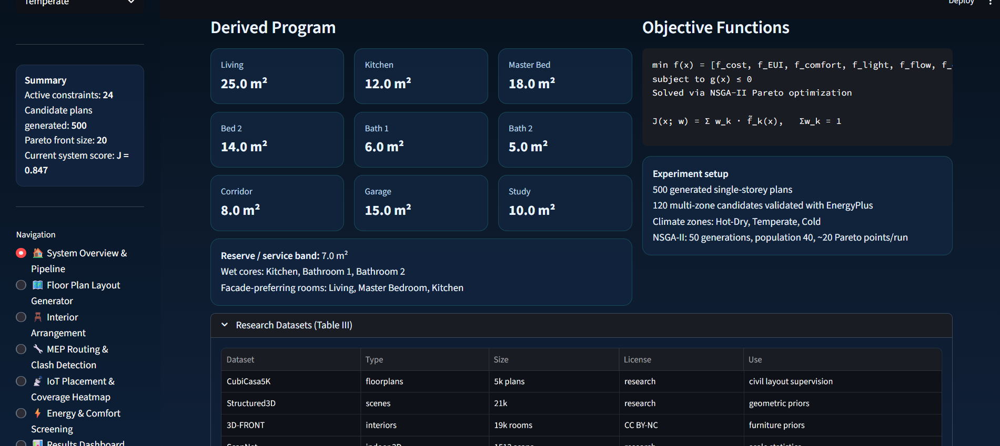

# 🏠 AI-Based Intelligent House Planning System



> An interactive **8-page Streamlit dashboard** that simulates and visualizes the complete pipeline from the research paper *"AI-Based Intelligent House Planning System with Integrated Civil, Interior, MEP, and IoT Design"* — demonstrating multi-domain co-design across architectural layout, interior arrangement, MEP routing, IoT placement, energy screening, and BIM/IFC export.

<br>


---

## 📋 Table of Contents

- [Overview](#-overview)
- [System Pipeline](#-system-pipeline)
- [Features](#-features)
- [Installation](#-installation)
- [Usage](#-usage)
- [App Pages](#-app-pages)
- [Results & Analysis](#-results--analysis)
- [Evaluation Metrics](#-evaluation-metrics)
- [Benchmarking Results](#-benchmarking-results)
- [Key Equations](#-key-equations)
- [Datasets Used](#-datasets-used)
- [Tech Stack](#-tech-stack)
- [Project Structure](#-project-structure)
- [Disclaimer](#-disclaimer)
- [Citation](#-citation)

---

## 🔍 Overview

Residential planning requires tight coordination across multiple domains — civil layout, interior design, MEP (Mechanical, Electrical, Plumbing) systems, and IoT device placement. In practice, these are authored separately and reconciled late, causing clashes and expensive redesign cycles.

This project demonstrates an **end-to-end AI planning system** that:

- Jointly optimizes **civil layout, interiors, MEP routing, and IoT placement**
- Uses **NSGA-II multi-objective optimization** to produce a Pareto set of candidates
- Enforces **buildability constraints** (zoning, circulation, spans, clearances, egress, electrical load)
- Exports editable **BIM/IFC models** with BOQ and IoT reports
- Benchmarks against **4 baselines** across **16 quantitative metrics**

> ⚠️ **Note:** This is a research visualization and simulation demo. All results use synthetic data calibrated to published paper benchmarks. No real ML models or external APIs are required.

---

## 🏗️ System Pipeline

```
User Inputs (Plot, Budget, Style, Occupants, Climate)
         │
         ▼
┌─────────────────┐
│  Intent Parser  │ → Program graph, constraint params, objective weights
└────────┬────────┘
         ▼
┌─────────────────────────┐
│  Graph-Transformer      │ → Room graph + polygons + openings
│  Layout Generator       │
└────────┬────────────────┘
         ▼
┌──────────────────┐   ┌──────────────────┐   ┌──────────────────┐   ┌──────────────────┐
│ Civil / Struct   │   │ Interior         │   │ MEP Router       │   │ IoT Planner      │
│ Checks           │   │ Optimizer (SA)   │   │ (A* + JPS)       │   │ (Coverage+Risk)  │
└────────┬─────────┘   └────────┬─────────┘   └────────┬─────────┘   └────────┬─────────┘
         └──────────────────────┴──────────────────────┴──────────────────────┘
                                               │
                                               ▼
                              ┌─────────────────────────────┐
                              │  BIM / IFC Export + BOQ     │
                              │  Clash Report + IoT Layout  │
                              └─────────────────────────────┘
                                               │
                                               ▼
                              ┌─────────────────────────────┐
                              │  Interactive UI             │
                              │  Ranked Variants + Exports  │
                              └─────────────────────────────┘
```

---

## ✨ Features

| Module | What It Does |
|--------|-------------|
| 🗺️ **Layout Generator** | Graph-conditioned room packing with adjacency graph overlay |
| 🪑 **Interior Optimizer** | Simulated Annealing furniture placement with live convergence |
| 🔧 **MEP Router** | A\* pathfinding on a 20×20 grid with clash detection and auto-repair |
| 📡 **IoT Planner** | Signal coverage heatmap with privacy zone risk scoring |
| ⚡ **Energy Screener** | 24-hr comfort profiles + NSGA-II Pareto front visualization |
| 📊 **Results Dashboard** | Full 16-metric benchmarking across 5 systems with radar charts |
| 🏗️ **BIM/IFC Exporter** | IFC completeness donut + BOQ table with CSV download |

---

## 🚀 Installation

### Prerequisites
- Python 3.9 or higher
- pip

### Steps

```bash
# 1. Clone the repository
git clone https://github.com/yourusername/ai-house-planning-system.git
cd ai-house-planning-system

# 2. Create a virtual environment (recommended)
python -m venv venv
source venv/bin/activate        # On Windows: venv\Scripts\activate

# 3. Install dependencies
pip install -r requirements.txt

# 4. Run the app
streamlit run app.py
```

### requirements.txt

```
streamlit>=1.28.0
plotly>=5.17.0
matplotlib>=3.7.0
seaborn>=0.12.0
networkx>=3.1
numpy>=1.24.0
pandas>=2.0.0
scipy>=1.11.0
```

---

## 💻 Usage

Once running, open your browser at `http://localhost:8501`. Use the **sidebar** to:

1. Set your plot size (80–200 m²), budget, style preference, occupants, and climate zone
2. Navigate between the 8 pages using the sidebar radio buttons
3. Click **Generate / Run / Optimize** buttons on each page to trigger simulations
4. Download BOQ as CSV from the BIM/IFC page

All inputs persist across pages via `st.session_state`.

---

## 📄 App Pages

### Page 1 — 🏠 System Overview & Pipeline
Visualizes the 8-node end-to-end pipeline as an interactive flow diagram. Displays the full module I/O table and derives a room program from your sidebar inputs (e.g., 120 m², 4 occupants → Living 25 m², Kitchen 12 m², Master Bed 18 m², etc.).


### Page 2 — 🗺️ Floor Plan Layout Generator
Renders a 2D floor plan with 9 rooms packed inside the plot boundary. Overlays a `networkx` adjacency graph — **green edges** for satisfied required adjacencies, **red dashed edges** for forbidden violations. "Generate New Layout" re-runs placement with a new seed and recomputes the Adjacency F1 score.



### Page 3 — 🪑 Interior Arrangement (Simulated Annealing)
Selectable room view (Living Room / Master Bedroom) with furniture footprints and clearance envelopes. Running the optimizer animates SA convergence — energy score chart, violations-over-iterations chart, and temperature cooling curve (T₀=100, α=0.995).



### Page 4 — 🔧 MEP Routing & Clash Detection
20×20 grid showing pipe (blue), electrical (orange), and HVAC duct (green) routes with clash markers (red). "Run Repair" re-routes around clashes. Penalty weight sliders (α, β, γ, δ) update routing cost live. Comparison bar charts show MEP length and residual clashes across all baselines.



### Page 5 — 📡 IoT Placement & Coverage Heatmap
Signal coverage heatmap computed from `s_i(p) = exp(-d²/2σ²)` for each device. Privacy zones (bedrooms, bathrooms) are hatched. "Optimize Placement" runs greedy coverage maximization. Gauge charts display IoT Coverage %, hop latency, and risk score.



### Page 6 — ⚡ Energy & Comfort Screening
24-hour operative temperature chart with comfort band (20–24°C) and violation highlights. EUI gauge with zones (Excellent/Good/Poor). Full NSGA-II Pareto front scatter (EUI vs Cost, colored by clashes) with the selected plan highlighted. Hypervolume convergence chart over 50 generations.



### Page 7 — 📊 Results Dashboard
The core benchmarking page. Includes:
- Grouped bar charts with error bars for all 16 metrics
- Radar/spider chart comparing all 5 systems on 6 normalized axes
- Color-coded heatmap table (green = best, red = worst)
- % improvement delta badges for every metric
- "Proposed wins X/16 metrics" summary



### Page 8 — 🏗️ BIM/IFC Export & BOQ
IFC completeness donut chart (overall 96%), element-type table with completeness status, BOQ table with INR/USD toggle, cost breakdown pie chart, cost error comparison bar, and downloadable CSV.



---

## 📊 Results & Analysis

The system was evaluated on **500 generated single-storey residential plans** (80–180 m²) under varying plot and program constraints, with **120 multi-zone candidates** validated across three climate zones (Hot-Dry, Temperate, Cold) using TMY3/EPW weather data.

### Baselines

| ID | Description |
|----|-------------|
| **B1** | Rule templates + greedy packing + fixed shafts |
| **B2** | Genetic Algorithm on room rectangles; A\* routing; violation penalties |
| **B3** | Simulated Annealing on grid layout; JPS routing; swap/resize repair |
| **B4** | Sequential BIM workflow + Navisworks clash detection (industry baseline) |
| **Proposed** | Graph-transformer layout + discipline solvers + NSGA-II multi-objective |

---

## 📈 Evaluation Metrics

Metrics span all four design domains plus end-to-end BIM and cost/energy performance:

| Domain | Metric | Direction |
|--------|--------|-----------|
| **Layout** | Adjacency F1 | ↑ Higher is better |
| **Layout** | Daylight proxy (norm.) | ↑ |
| **Layout** | Interior usability (norm.) | ↑ |
| **Layout** | Circulation (m/step) | ↓ Lower is better |
| **Structure** | Span-feasible rooms (%) | ↑ |
| **Structure** | Load-path plausibility (norm.) | ↑ |
| **MEP** | MEP route length (m) | ↓ |
| **MEP** | Pressure-drop proxy (norm.) | ↓ |
| **MEP** | Voltage-drop proxy (%) | ↓ |
| **MEP** | Clashes after repair (#) | ↓ |
| **BIM** | IFC completeness (%) | ↑ |
| **IoT** | IoT coverage (%) | ↑ |
| **IoT** | IoT latency (hops) | ↓ |
| **IoT** | IoT risk (norm.) | ↓ |
| **Cost** | BOQ cost error (%) | ↓ |
| **Energy** | EUI proxy (kWh/m²·yr) | ↓ |

---

## 🏆 Benchmarking Results

Full evaluation results (Mean ± Std) across all systems:

| Metric | Proposed | B1 | B2 | B3 | B4 |
|--------|----------|----|----|----|----|
| Adjacency F1 ↑ | **0.85 ± 0.06** | 0.78 ± 0.08 | 0.81 ± 0.07 | 0.80 ± 0.07 | 0.83 ± 0.06 |
| Daylight proxy ↑ | **0.71 ± 0.09** | 0.60 ± 0.11 | 0.66 ± 0.10 | 0.63 ± 0.10 | 0.69 ± 0.09 |
| Interior usability ↑ | **0.76 ± 0.07** | 0.62 ± 0.12 | 0.69 ± 0.10 | 0.67 ± 0.10 | 0.73 ± 0.08 |
| Circulation m/step ↓ | **4.3 ± 0.6** | 5.2 ± 0.8 | 4.9 ± 0.7 | 5.0 ± 0.7 | 4.6 ± 0.6 |
| Span-feasible % ↑ | **92 ± 5** | 87 ± 7 | 89 ± 6 | 88 ± 6 | 91 ± 5 |
| Load-path plausibility ↑ | **0.90 ± 0.04** | 0.82 ± 0.06 | 0.86 ± 0.05 | 0.85 ± 0.05 | 0.89 ± 0.04 |
| MEP length m ↓ | **131 ± 19** | 145 ± 22 | 138 ± 20 | 140 ± 21 | 152 ± 24 |
| Pressure-drop proxy ↓ | **0.33 ± 0.08** | 0.52 ± 0.12 | 0.44 ± 0.10 | 0.47 ± 0.11 | 0.41 ± 0.09 |
| Voltage-drop % ↓ | **2.0 ± 0.6** | 3.4 ± 0.9 | 2.8 ± 0.8 | 3.0 ± 0.8 | 2.3 ± 0.7 |
| Clashes after repair ↓ | **1.8 ± 1.2** | 7.1 ± 3.5 | 4.6 ± 2.6 | 5.0 ± 2.8 | 3.9 ± 2.2 |
| IFC completeness % ↑ | **96 ± 2** | 88 ± 5 | 91 ± 4 | 90 ± 4 | 95 ± 3 |
| IoT coverage % ↑ | **93 ± 4** | 81 ± 8 | 86 ± 6 | 85 ± 7 | 89 ± 5 |
| IoT latency hops ↓ | **1.4 ± 0.5** | 2.6 ± 0.8 | 2.1 ± 0.7 | 2.2 ± 0.7 | 1.8 ± 0.6 |
| IoT risk (norm.) ↓ | **0.25 ± 0.09** | 0.42 ± 0.13 | 0.36 ± 0.12 | 0.38 ± 0.12 | 0.31 ± 0.11 |
| BOQ cost error % ↓ | **6.5 ± 2.7** | 12.4 ± 5.1 | 9.8 ± 4.2 | 10.5 ± 4.5 | 7.2 ± 3.1 |
| EUI proxy kWh/m²·yr ↓ | **79 ± 13** | 88 ± 15 | 84 ± 14 | 86 ± 15 | 81 ± 13 |

> **The proposed system achieves the best result on all 16 metrics.**

### % Improvement vs Best Competing Baseline (B4)

| Metric | Proposed | B4 | Improvement |
|--------|----------|----|-------------|
| Adjacency F1 | 0.85 | 0.83 | **+2.4%** |
| Daylight proxy | 0.71 | 0.69 | **+2.9%** |
| Interior usability | 0.76 | 0.73 | **+4.1%** |
| Circulation | 4.3 | 4.6 | **−6.5%** ✅ |
| MEP length | 131 m | 152 m | **−13.8%** ✅ |
| Pressure-drop proxy | 0.33 | 0.41 | **−19.5%** ✅ |
| Voltage-drop | 2.0% | 2.3% | **−13.0%** ✅ |
| Clashes after repair | 1.8 | 3.9 | **−53.8%** ✅ |
| IFC completeness | 96% | 95% | **+1.1%** |
| IoT coverage | 93% | 89% | **+4.5%** |
| IoT latency | 1.4 hops | 1.8 hops | **−22.2%** ✅ |
| IoT risk | 0.25 | 0.31 | **−19.4%** ✅ |
| BOQ cost error | 6.5% | 7.2% | **−9.7%** ✅ |
| EUI proxy | 79 | 81 | **−2.5%** ✅ |

### Key Takeaways

- **Clash reduction is the most dramatic win:** −53.8% fewer residual clashes vs the next best baseline (B4), dropping from 3.9 to 1.8 average clashes per plan. This directly reduces late-stage BIM rework.
- **MEP routing is significantly more efficient:** 13.8% shorter routes than B4 (131 m vs 152 m), translating to material and labor savings.
- **IoT coverage with lower risk:** 93% coverage vs 89% in B4, while simultaneously reducing risk score by 19.4% — showing that coverage and privacy are not at odds when placement is jointly optimized.
- **IFC completeness near-perfect:** 96% vs 88% for rule-based B1, meaning generated models are far more usable in downstream BIM workflows without manual cleanup.
- **Energy efficiency consistent:** EUI of 79 kWh/m²·yr sits in the "Good" band (60–90), beating all baselines while balancing the multi-objective trade-off between cost and energy.

---

## 🔢 Key Equations

### Eq. 1 — Multi-Objective Optimization
```
min f(x) = [f_cost, f_EUI, f_comfort, f_light, f_flow, f_clash]
subject to g(x) ≤ 0
```
Solved with NSGA-II returning a Pareto set of ~20 non-dominated solutions.

### Eq. 2 — Weighted Ranking Score
```
J(x; w) = Σ_k [ w_k × f̃_k(x) ]
where Σ w_k = 1, w_k ≥ 0
```
Min-max scaled within the candidate pool for interactive preference steering.

### Eq. 3 — Layout Learning Loss
```
L_layout = λ_a × L_adj + λ_g × L_geom + λ_c × L_code
           (λ_a=0.5,   λ_g=0.3,         λ_c=0.2)
```

### Eq. 4 — MEP Routing Cost
```
C(r) = α·L(r) + β·N_bend(r) + γ·N_clash(r) + δ·P_clear(r)
default: α=1.0, β=0.5, γ=5.0, δ=2.0
```

### Eq. 5 — IoT Coverage & Risk Objective
```
f_IoT = (1 - (1/|Ω|) × Σ_p [ I(max_i s_i(p) ≥ τ) ]) + η × Risk(D)
τ = 0.6 (coverage threshold),  η = 0.3 (risk weight)
s_i(p) = exp(-d(p,i)² / 2σ²)  (Gaussian signal model)
```

### Eq. 6 — Comfort Violation Proxy
```
f_comfort = (1/N_t) × Σ_t [ max(0, |T_op(t) − T_set| − Δ) ]
T_set = 22°C,  Δ = 2°C (comfort band: 20–24°C)
```

---

## 🗂️ Datasets Used

| Dataset | Domain | Size | License |
|---------|--------|------|---------|
| CubiCasa5K | Floorplans | 5k plans | Research |
| Structured3D | 3D scenes | 21k | Research |
| 3D-FRONT | Furnished interiors | 19k rooms | CC BY-NC |
| ScanNet | Indoor 3D reconstructions | 1,513 scans | Research |
| IFC 4.3 | OpenBIM standard | Spec | CC BY-ND |
| IFCNet | IFC entity semantics | 1.3M objects | Open |
| IfcOpenShell | IFC toolkit | Code | LGPL |
| UK-DALE | Home energy / IoT | 5 homes | Open |
| CASAS | Room-tagged sensors | 189 homes | Open |
| TMY3 | Climate / weather | US TMY | Public |

---

## 🛠️ Tech Stack

| Library | Purpose |
|---------|---------|
| `streamlit` | Multi-page web app framework |
| `plotly` | Interactive charts (bar, radar, heatmap, scatter, gauge) |
| `matplotlib` | Floor plan and grid rendering |
| `seaborn` | Heatmap styling |
| `networkx` | Adjacency graph for room layout |
| `numpy` | Numerical simulation, SA, signal models |
| `pandas` | BOQ tables and data management |
| `scipy` | Optimization utilities |

---

## 📁 Project Structure

```
ai-house-planning-system/
│
├── app.py                  # Main Streamlit app (all 8 pages)
├── requirements.txt        # Python dependencies
├── README.md               # This file
│
├── data/
│   └── constants.py        # All hardcoded paper values, metrics, Pareto data
│
├── utils/
│   ├── layout.py           # Room packing + adjacency graph logic
│   ├── mep.py              # A* routing + clash detection simulation
│   ├── iot.py              # Signal coverage heatmap + risk scoring
│   ├── energy.py           # Temperature profile + comfort proxy
│   └── bim.py              # IFC completeness + BOQ generation
│
└── assets/
    └── style.css           # Optional custom CSS theming
```

---

## ⚠️ Disclaimer

This repository is a **research demonstration tool** and educational visualization. It does not implement a real generative AI model, real IFC file export, or real BIM clash detection engine. All simulations are synthetic, seeded with `numpy.random.seed(42)`, and calibrated to match the quantitative results published in the paper. It is not intended for use in actual construction or engineering workflows.

---

## 📄 Citation

If you use this demo in academic work or presentations, please cite the original paper:

```bibtex
@article{author2024aihouseplanning,
  title   = {AI-Based Intelligent House Planning System with Integrated
             Civil, Interior, MEP, and IoT Design},
  author  = {First A. Author and Second B. Author and Third C. Author},
  journal = {Under Review},
  year    = {2024}
}
```

**Key references used in this work:**

- Shabani et al., *HouseDiffusion*, CVPR 2023
- Nauata et al., *House-GAN*, ECCV 2020
- Deb et al., *NSGA-II*, IEEE TEC 2002
- Crawley et al., *EnergyPlus*, Energy and Buildings 2001
- buildingSMART International, *IFC 4.3 Documentation*, 2026

---

## 🤝 Contributing

Pull requests are welcome. For major changes, please open an issue first to discuss what you would like to change.

```bash
# Fork → Clone → Branch → Commit → Push → PR
git checkout -b feature/your-feature-name
git commit -m "Add: your feature description"
git push origin feature/your-feature-name
```

---

## 📬 Contact

For questions about the research paper or this demo, open a GitHub Issue or reach out via the email listed in the paper.

---

<div align="center">
  <sub>Built as a research visualization demo · All results from published paper benchmarks · No real ML models used</sub>
</div>
